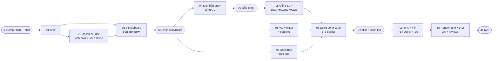

# SaaS Demo Video Studio

**Video review / giới thiệu web app từ MÀN HÌNH THẬT — chỉ bằng 1 prompt trong Claude Code.**
Recon web → 3 storyboard → kịch bản quay chi tiết → quay MACRO MODE trên Chrome đã đăng nhập → VO tiếng Việt (VieNeu, local)
→ nhạc nắn theo lưới BPM → dựng HyperFrames + GSAP bằng nhiều agent song song (Opus 5.5 lên plan/review, Sonnet 5.5 dựng) → mix −14 LUFS + .srt →
16:9 + 9:16 → reviewer độc lập. Mọi con số trên hình lấy từ web thật; mọi cổng nghiệm thu là phép đo.

> Trạng thái: **v1.0 — đóng gói từ 1 ca thật** (ProfitBase, 26–28/09/2026). Xem Giới hạn trước khi hứa với khách.

## Demo

- Video mẫu: _(link sẽ thêm khi chủ sản phẩm cho phép công khai)_ — `<VIDEO_LINK_PLACEHOLDER>`
- Ca thật đã làm sạch: [`examples/profitbase/`](examples/profitbase/) (kịch bản quay 18 shot, storyboard 13 chương, số đo).

## QUICKSTART: 1 PROMPT

```bash
git clone <repo-url> saas-demo-video-studio && cd saas-demo-video-studio
pip install -r requirements.txt          # + ffmpeg trên PATH, Node 18+, VieNeu-TTS trong venv riêng (xem Yêu cầu)
cp .env.example .env                     # tuỳ chọn: OPENAI_API_KEY để căn caption từng từ; VIENEU_PY
claude                                   # Claude Code, extension Claude in Chrome đã kết nối, Chrome đã đăng nhập app
```

Rồi gõ đúng 1 prompt (mẫu đầy đủ + cách bỏ qua cổng: [`PROMPT.md`](PROMPT.md)):

```
Làm video review cho https://app.example.com — tour 60–80 s, 16:9 + 9:16 + .srt, giọng VieNeu, trang cấm /admin.
```

Agent chạy hết pipeline, chỉ dừng ở **3 cổng**: **U1** chọn storyboard · **U0** nhắn `sẵn sàng` rồi để máy yên lúc quay ·
**U2** duyệt khung tĩnh + cảnh thử 15–20 s. Thêm `storyboard: auto` / `duyệt U2: auto` để bỏ U1/U2 bằng mặc định.

## Pipeline



| # | Bước | Agent | Doc |
|---|---|---|---|
| 01 | Brief | phiên chính | [pipeline/01-brief.md](pipeline/01-brief.md) |
| 02 | Recon + web-data + seed | `sdv-recon` | [02](pipeline/02-recon.md) |
| 03 | 3 storyboard + stills | `sdv-builder` | [03](pipeline/03-storyboard.md) |
| 04 | Kịch bản quay + G0 | `sdv-capture` | [04](pipeline/04-capture-script.md) |
| 05 | E0 + quay macro | `sdv-capture` | [05](pipeline/05-e0-macro-capture.md) |
| 06 | VO + caption | `sdv-voiceover` | [06](pipeline/06-voiceover.md) |
| 07 | Lưới nhạc | `sdv-audio-mix` | [07](pipeline/07-music-grid.md) |
| 08 | Dựng | `sdv-builder` ×1–3 | [08](pipeline/08-build.md) |
| 09 | Mix + .srt | `sdv-audio-mix` | [09](pipeline/09-mix.md) |
| 10 | Render + QA + giao | phiên chính + `sdv-reviewer` | [10](pipeline/10-qa-deliver.md) |

Điều phối: phiên chính (đạo diễn, Opus 5.5) lên plan → xin duyệt → spawn agent con chạy song song (dựng/quay/mix = `model: sonnet`, xem *Phân vai model*)
→ reviewer độc lập đo lại → mới trình người dùng. Chi tiết: [`.claude/skills/saas-demo-video-studio/SKILL.md`](.claude/skills/saas-demo-video-studio/SKILL.md).

## Phân vai model

> User chốt 30/09/2026: "sonnet 5.5 đang làm rất tốt, đảm bảo Opus 5.5 lên plan sau đó đưa cho sonnet 5.5 làm các video motion nhé, phần nào khó quá thì mới cho opus 5.5 làm"

| Vai | Model | Cách |
|---|---|---|
| Phiên chính: brief · plan · storyboard · review cuối; `sdv-recon`, `sdv-reviewer` | **Opus 5.5** | phiên chính; agent để trống `model` ⇒ kế thừa |
| Dựng · quay · mix · VO: `sdv-builder`, `sdv-capture`, `sdv-audio-mix`, `sdv-voiceover` | **Sonnet 5.5** | `model: sonnet` trong `.claude/agents/*.md` |
| Việc khó: debug khó · thiết kế/sửa engine · fail review 2 vòng liên tiếp | **Opus 5.5** | phiên chính spawn lại agent, **bỏ trống** `model` |

Phân vai này **chưa có số đo** (số vòng review / video, thời gian); ghi lại ở ca đầu.

## Tuỳ chọn: code-rendered-video

Nếu video cần thêm đoạn motion thuần (logo sting, intro/outro, chuyển cảnh, showreel) ngoài footage màn hình thật, có thể dùng skill
**code-rendered-video** của tác giả bên thứ ba: giấy phép **MIT (c) 2026 viettran**. Repo này **KHÔNG kèm** skill đó — tự lấy bản gốc từ nguồn của tác giả
và giữ nguyên giấy phép. Cách ghép footage + motion (nối ở tầng MP4 hoặc nhúng clip vào composition) **chưa được thử**.

## Cấu trúc repo

```
.claude/skills/saas-demo-video-studio/   SKILL.md + references/ + templates/   (copy thẳng vào dự án)
.claude/agents/                          6 agent 6-khối: recon · capture · voiceover · builder · audio-mix · reviewer
pipeline/                                10 bước: input · lệnh · output · cổng
scripts/                                 Python/JS/PS1 đã chạy trong ca thật, tổng quát hoá (xem scripts/README.md: TESTED / UNTESTED)
engine/                                  khung HyperFrames: engine.js (window.HF) · motion-kit.js · txfx-v2.js · v6-kit.js + v6.css (lớp nâng cấp v6) · tokens.css · 2 scene mẫu
examples/profitbase/                     ca thật đã làm sạch
```

## Yêu cầu

- **Windows 10/11** (quay: ffmpeg `gfxcapture`/`gdigrab`; macOS/Linux cần đổi nguồn quay — CHƯA thử).
- **Claude Code** + extension **Claude in Chrome**; Chrome đăng nhập tài khoản **demo có dữ liệu đẹp**.
- **Python 3.11+** (`requirements.txt`), **ffmpeg + ffprobe** trên PATH, **Node 18+** (`npx hyperframes@0.8.78`).
- **VieNeu-TTS** (Apache-2.0) trong venv riêng, đặt `VIENEU_PY=<venv>/Scripts/python.exe`. Tuỳ chọn: `OPENAI_API_KEY` (whisper-1 căn chữ).
- Font **Inter** + **IBM Plex Serif** Italic/BoldItalic (OFL) tải từ Google Fonts vào `engine/assets/fonts/` — [engine/README.md](engine/README.md).
- Nhạc/SFX: thư viện của bạn (có bản quyền) hoặc sinh bằng dịch vụ AI của bạn — repo KHÔNG kèm file âm thanh.

## Chi phí / thời gian (SỐ ĐO THẬT, 1 ca, laptop 4 nhân không GPU rời)

| | Đo được |
|---|---|
| Quay macro mode | 10 shot / 17 phút (~7,6 lượt gọi agent/shot) · kiểu cũ từng bước ~13,9 lượt/shot |
| VO VieNeu | 27 câu sinh trong 150 s (nạp model 44 s), 0 đ API |
| Nhạc | 0 credit khi nắn bài có sẵn theo lưới (41/41 downbeat, lệch tối đa 21,8 ms); bản v1 sinh mới: 1.520 credit Magnific |
| Render full (81 s video) | 16:9 11m38s · 9:16 12m56s (HyperFrames, 3 worker) |
| Bản v1 (đường cũ, không storyboard) | ~3,5M token, 13 lượt agent = 373 phút cộng dồn, 2.980 credit AI, 1 ngày làm việc |
| **1 prompt → bản nháp trong 30–45 phút** | **CHƯA ĐO** — mục tiêu thiết kế; ca đầu tiên chạy repo hãy điền bảng trong `references/cost-time.md` |

Kết quả ca mẫu: v1 16:9 68,5 s −14,1 LUFS **được duyệt**; v3 (pipeline của repo này) 81,2 s −14,3 LUFS, khách chấm **7/10**
("thiếu motion graphic / 3D / flip"). Sau đó v3 bị từ chối (user: giữ diện mạo v5, chỉ nâng cấp) → **v6 = v5 đã duyệt + nâng cấp** (12 chuyển cảnh 3D đúng phách, 24 số split-flap, khối kính): đã render 16:9 ngày 30/09/2026; 9:16 chưa làm; chưa có bằng chứng người dùng duyệt v6.

## Giới hạn

- Mới 1 ca, 1 app (form tính toán + dashboard, tiếng Việt). 7 dạng app còn lại trong `capture-script-by-app-type.md` là mẫu suy ra.
- Chỉ Windows cho bước quay. Macro mode mới thử trên app React.
- Cần người dùng để máy yên lúc quay (cổng U0) — không quay "ngầm" được.
- Script có nhãn `STATUS: TESTED / SMOKE-TESTED / UNTESTED` — bản tổng quát hoá chưa chạy lại end-to-end trên ca thứ 2.
- `engine/lib/engine.js` + `motion-kit.js` là **snapshot v3** (pass v3.1 không hoàn tất); lớp nâng cấp được duy trì là `engine/lib/v6-kit.js` — bản gốc đã render trong ca thật, bản TỔNG QUÁT chỉ mới SMOKE-TESTED (xem `engine/README.md`).
- Chất lượng phụ thuộc dữ liệu demo: tài khoản trống → video yếu.

## ROADMAP / TODO

- [x] ~~sync-v3.1~~ → thay bằng `engine/lib/v6-kit.js` (v6 = v5 đã duyệt + nâng cấp); còn lại: render thử 1 video đầy đủ bằng kit tổng quát, và nối vào `engine.js` (chưa thử).
- [ ] Bấm giờ trọn 1 prompt → bản nháp ở ca thứ 2; cập nhật bảng chi phí.
- [ ] Thêm video demo công khai. Xem thêm `TODO.md`.

## English (short)

**SaaS Demo Video Studio** turns a live, logged-in web app into a narrated review/demo video (16:9 + 9:16 + .srt) from a
single Claude Code prompt: read-only recon → 3 storyboards → a detailed capture script (gate G0) → an environment gate (E0)
and one-JavaScript-macro-per-shot screen capture → local Vietnamese TTS (VieNeu) aligned word by word → music conformed to
a BPM bar grid → a deterministic HyperFrames + GSAP composition built by parallel sub-agents (Opus 5.5 plans and reviews, Sonnet 5.5 builds; escalate to Opus for hard work) → −14 LUFS mix →
independent reviewer. The only human stops are: pick a storyboard (U1), say "sẵn sàng" and leave the machine alone while
it records (U0), approve stills + a 15–20 s test scene (U2). Every number on screen must come from the live app; every QA
gate is a measurement. Packaged from one real case; see *Giới hạn* for what is not measured yet. Code: MIT; third-party
components: [`THIRD_PARTY.md`](THIRD_PARTY.md).

## License

MIT for this repository's code and docs — [`LICENSE`](LICENSE). Third-party tools/fonts/services keep their own licences —
[`THIRD_PARTY.md`](THIRD_PARTY.md). No footage, audio, fonts or renders are included.
